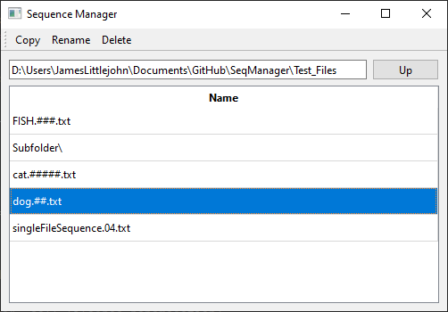

# SeqManager
A simple file sequence renaming tool created in python using PyQT

## Requirements
This app requires python3 and PyQt6
if you have pip working, you can use 'pip install PyQt6' to install it.

if those dependencies are installed, then you should be able to launch the application by double-clicking on SeqManager.pyw

## Usage
The top tool bar has buttons for "Copy", "Rename", and "Delete". if you have a sequence selected in the file list then clicking any of these buttons will apply that action to the sequence you can also access these actions in a context menu by right clicking on a sequence.
Additionally, double-clicking on a sequence will initiate the rename action

below the top tool bar is a directory path that you can use to change the current directory you are in.

further down is file list, which shows the files and directories in the current directory. in this list, sequences of files are shown as one item with # symbols representing their frame numbers.

When you rename or copy a sequence you can change the number of # symbols in the file name and that will control how many zeros the frame number is padded with.

